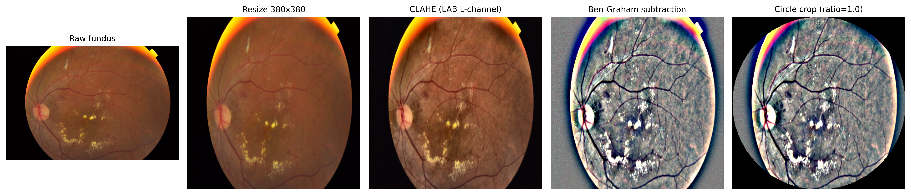
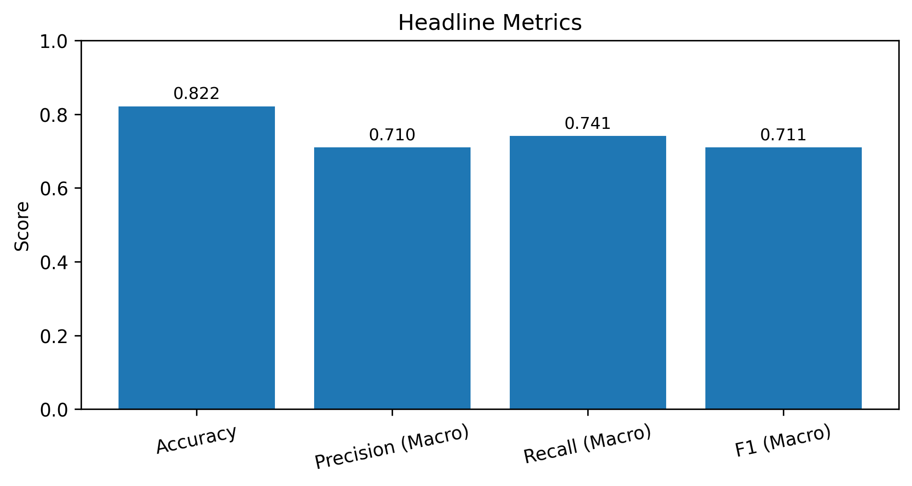

# Explainable Diabetic Retinopathy Classification Pipeline

An end-to-end reproducible pipeline for five-class diabetic retinopathy (DR) severity grading on the APTOS 2019 dataset, with post-hoc explainability via Grad-CAM and SHAP. Built as the ITPG708 final project.

This README covers how to run the code and where outputs land. Experimental findings and statistical results live in [the project report](src/report/XAI_Final-ProjectReport.pdf).

**Stack:**

- Backbone: EfficientNet-B4 (ImageNet-pretrained) fine-tuned with focal loss, plus temperature scaling post-training.
- Explainers: Grad-CAM (captum `LayerGradCam`) and SHAP (`DeepExplainer`), with a retinal-disc attribution mask applied before any XAI metric is computed.
- Single entry point: [notebooks/project_demo.ipynb](notebooks/project_demo.ipynb).
- Every stage is idempotent: once a checkpoint, predictions file, or XAI table exists, subsequent runs reuse it unless you force a rebuild.

---

## Project Layout

```
ITPG708Project/
├── configs/
│   └── base.yaml                    # single source of truth for hyperparameters
├── dataset/
│   └── aptos2019/                   # APTOS 2019 labels and image folders
├── notebooks/
│   └── project_demo.ipynb           # primary entry point — runs the full pipeline
├── src/
│   ├── data.py                      # config, seeds, paths, CSV parsing, splits,
│   │                                # manifests, preprocessing, Dataset classes
│   ├── train.py                     # DRClassifier, focal loss, training loop,
│   │                                # temperature calibration, evaluation,
│   │                                # checkpoint/run plumbing
│   ├── xai.py                       # public facade; re-exports every
│   │                                # name; implementation is split
│   │                                # across the xai_*.py siblings below
│   ├── xai_viz.py                   # pure rendering (overlays,
│   │                                # attribution-grid renderer)
│   ├── xai_stats.py                 # paired Wilcoxon + t-test +
│   │                                # McNemar + bootstrap CI
│   ├── xai_metrics.py               # retinal-disc mask, border
│   │                                # ring, mass ratios, multi-k faithfulness
│   ├── xai_common.py                # device resolver, predict-
│   │                                # with-temperature, calibration lookup
│   ├── xai_gradcam.py               # Grad-CAM + layer resolver
│   │                                # + 4-case demo grid + class grid
│   ├── xai_shap.py                  # SHAP + MBConv/Bottleneck
│   │                                # compat patches + per-class SHAP grid
│   ├── xai_audit.py                 # run_xai_analysis orchestrator
│   │                                # + _build_xai_* aggregate-table family
│   ├── xai_single.py                # single-case flow
│   │                                # (explain_single_image_detailed,
│   │                                # run_single_case_demo)
│   ├── xai_notebook.py              # the 5 notebook_* wrappers
│   └── report/                      # LaTeX report + assets consumed by Overleaf
│       ├── XAI_Final-ProjectReport.tex
│       └── assets/                  # figure02..figure13 PNGs referenced by the TEX
├── tools/
│   ├── export_project_demo_assets.py    # legacy demo export (figure1..figure10)
│   ├── export_preprocessing_steps.py    # produces figure12_preprocessing_example
│   ├── gen_class_distribution_overall.py  # produces figure13_class_distribution_overall
│   ├── refresh_report_assets.py         # regenerates figure08/09/10/11a/11b in src/report/assets
│   ├── build_ablation_table.py          # rebuilds mask-ablation + per-class CSVs
│   ├── run_xai_full.py                  # shell-side driver for the XAI audit
│   └── smoke_xai_n4.py                  # N=4 smoke test for XAI changes
├── artifacts/
│   ├── checkpoints/                 # trained .pt + calibration .json
│   ├── predictions/                 # per-split prediction CSVs
│   ├── manifests/                   # frozen train/val/test splits
│   ├── logs/                        # per-run metadata, training history, XAI status
│   └── reports/
│       ├── tables/                  # evaluation + XAI audit CSVs (see below)
│       └── figures/                 # Grad-CAM / SHAP / single-case overlay PNGs
└── requirements.txt
```

### Module dependency chain

`src/` is a flat layout (no package, no `__init__.py`). The outer pipeline is a strict linear chain:

```
data.py  →  train.py  →  src.xai
```

- `data.py` has no upstream dependencies. It can run without PyTorch imports failing. Owns config loading, seeding, path utilities, CSV parsing, stratified splits, manifests, the preprocessing pipeline, and the `_FundusDataset` class.
- `train.py` imports explicit names from `src.data`. Owns the `DRClassifier` model, focal loss, the training loop, temperature calibration, all evaluation metrics, and checkpoint/run plumbing.
- `src.xai` is a **thin facade** (`src/xai.py`, ~270 lines) that re-exports every public name. The actual code lives in 9 sibling modules organised as a strict DAG (layer N imports only from layers < N):

```
L1 (leaves):          xai_viz      xai_stats      xai_metrics     xai_common
                          │            │              │               │
                          └────────────┼──────────────┼───────────────┘
                                       ▼              ▼
L2 (method compute):              xai_gradcam    xai_shap
                                       └───────┬──────┘
                                               ▼
L3 (aggregate audit):                      xai_audit
                                               │
                                   ┌───────────┴───────────┐
                                   ▼                       ▼
L4 (orchestration / adapters): xai_single              xai_notebook
                                   └───────────┬───────────┘
                                               ▼
L5 (public facade):                          xai.py
```

- **Only `xai_gradcam.py` imports `captum`; only `xai_shap.py` imports `shap`.** Every other module runs fine without them.
- External callers (notebook cells, `tools/*.py`, `refresh_report_assets.py`) use `from src.xai import X`. The facade re-exports preserve every public name, so no import-site change is needed anywhere outside `src/`.
- Sibling modules never import from `src.xai`; imports only flow bottom-up in the DAG, so there is a strict topological order and no circular-import risk.

---

## Setup

### 1. Python environment

Developed and tested against Python 3.11 in a conda env named `itpg708`. From a fresh env:

```bash
conda create -n itpg708 python=3.11
conda activate itpg708
pip install -r requirements.txt
```

Dependencies (pinned in [requirements.txt](requirements.txt)):

- `torch==2.9.1`, `torchvision==0.24.1` — backbone + data loading
- `captum==0.7.0` — Grad-CAM via `LayerGradCam`
- `shap==0.47.2` — SHAP via `DeepExplainer`
- `scipy>=1.11` — Wilcoxon signed-rank and paired t-tests for the continuous XAI analysis
- `scikit-learn==1.6.1` — confusion matrix, macro/weighted metrics, QWK
- `pandas==2.2.3`, `numpy==2.1.3`, `matplotlib==3.10.0`, `Pillow==11.1.0`, `PyYAML==6.0.2`

### 2. Dataset

See [dataset/README.md](dataset/README.md) for the dataset used and expected local folder layout.

Download APTOS 2019 from Kaggle and place it under `dataset/aptos2019/` with paths matching [configs/base.yaml](configs/base.yaml):

```
dataset/aptos2019/
├── train_1.csv              # training labels
├── valid.csv                # validation labels
├── test.csv                 # test labels
├── train_images/            # training image PNGs
├── val_images/              # validation image PNGs
└── test_images/             # test image PNGs
```

### 3. Device

The pipeline auto-detects CUDA, MPS (Apple Silicon), or CPU via `_resolve_device` (in [src/data.py](src/data.py)) and `_resolve_xai_device` (in [src/xai_common.py](src/xai_common.py)). No manual device selection is needed.

**Known device-specific behaviour:**

- On **MPS**, `DataLoader` workers are forced to `num_workers=0` inside inference helpers ([src/train.py:689](src/train.py#L689), [src/train.py:751](src/train.py#L751)) because multi-process DataLoaders with MPS tensors can deadlock.
- On **CUDA**, SHAP DeepExplainer has a CPU fallback path (`_should_retry_shap_on_cpu` in [src/xai_shap.py](src/xai_shap.py)) that triggers automatically on CUDA OOM.
- On **CPU**, everything works but is ~5x slower.

---

## How to run

Open the notebook and execute top-to-bottom:

```bash
jupyter notebook notebooks/project_demo.ipynb
```

The notebook has two setup cells (Colab drive mount + imports) followed by numbered sections 1 through 9.

### Control flags (Section 2 "Run Configuration")

The "Run Configuration" cell is the single control panel. All other cells read from these variables:

| Flag | Default | Purpose |
|---|---|---|
| `SEED` | `1988` | Run seed. The committed checkpoint was trained with this seed. |
| `EVAL_SPLIT` | `'test'` | Which split to evaluate and audit on. |
| `RUN_CLEAN_BEFORE_START` | `False` | If `True`, wipes all artifacts before starting. **Leave False** unless you want a full rebuild. |
| `FORCE_RETRAIN` | `False` | If `False`, the training cell reuses an existing checkpoint whose config signature matches. **Leave False** to avoid a 58-minute retrain. |
| `XAI_SAFE_MODE` | `False` | If `True`, the XAI audit uses smaller SHAP background / sample sizes and forces CPU execution. Flip to `True` only if you hit MPS/CUDA memory pressure. |
| `SHOW_ADVANCED_XAI_AUDIT` | `False` | If `True`, the audit displays extra tables (correctness split, class-wise pass rate, discordant cases). |
| `XAI_VIS_SAFE_MODE` | `False` | Controls the visual review grids. Flip on for smaller memory budget. |
| `XAI_SINGLE_SAFE_MODE` | `False` | Controls the single-case demo. |

### What each section does

| Section | What it does | Runtime with reuse | What it produces |
|---|---|---|---|
| 1. Environment Setup | adds project root to `sys.path` | <1s | — |
| 2. Run Configuration | sets the control flags above | <1s | — |
| 3. Optional Output Reset | wipes artifacts if `RUN_CLEAN_BEFORE_START=True` | <1s | — |
| 4. Data Preparation | generates / reuses train/val/test manifests | ~5–10s | `artifacts/manifests/` |
| 5. Model Fine-Tuning | reuses checkpoint if config signature matches; else trains from scratch | ~5s reused / ~60min fresh | `artifacts/checkpoints/` + calibration JSON |
| 6. Core Evaluation | inference on the eval split, confusion matrix, per-class metrics, headline table, calibration | ~1–2min on MPS | `artifacts/predictions/`, `artifacts/reports/tables/` |
| **7. Explainability Analysis** | Grad-CAM + SHAP audit at N=120 (24 per class), retinal-disc mask applied before metrics, then renders the continuous + threshold comparison tables. Gated advanced breakdown shown when `SHOW_ADVANCED_XAI_AUDIT=True`. | ~13–16 min on MPS at `shap_background_size=16` | `rq_xai_method_stats`, `rq_xai_pairwise`, `rq_xai_continuous`, `rq_xai_mask_ablation`, `rq_xai_per_class`, `rq1_gradcam`, `rq2_shap`, per-sample Grad-CAM / SHAP overlay PNGs |
| 8. Visual Review | Grad-CAM + SHAP demo grids across target classes | ~3–5min | `gradcam_demo_grid.png`, `shap_demo_grid.png` |
| 9. Single-Case Demo | detailed XAI panel for one fundus image | ~30s | `artifacts/reports/figures/single/` |

### Reuse semantics

- **Manifests** are regenerated deterministically from the stratification seed every time. Fast but idempotent.
- **Checkpoint reuse** is driven by `_checkpoint_config_signature(cfg)` in [src/train.py](src/train.py). If the current config hashes to the same signature as an existing checkpoint for the same seed, that checkpoint is reused and training returns in seconds. Change any training hyperparameter (loss, optimizer, epochs, lr, batch size, etc.) and the signature changes, triggering a fresh run.
- **Predictions CSVs** are regenerated on every evaluation run to stay consistent with whatever checkpoint is loaded.
- **XAI tables and figures** are always regenerated by Section 7. The pipeline does not auto-wipe the `gradcam/`, `shap/`, or `single/` figure directories between runs — manually clean them if you change `max_targets` or `seed` to avoid stale per-sample PNGs from a previous configuration.

### If Section 7 fails with out-of-memory

1. In the run configuration cell, set `XAI_SAFE_MODE = True`. This forces the audit onto CPU and caps SHAP at 24 background / 24 samples.
2. Re-run from the run configuration cell. All upstream work (manifests, training, core evaluation) is cached.
3. If it still fails, lower `shap_background_size` and `shap_max_samples` in [configs/base.yaml](configs/base.yaml). Current defaults: `shap_max_samples: 120`, `shap_background_size: 16`, `max_targets: 120`, `attribution_mask_radius_ratio: 0.50`.

The pipeline has an automatic CPU fallback (`_should_retry_shap_on_cpu` in [src/xai_shap.py](src/xai_shap.py)) that catches CUDA OOM, MPS OOM, and SHAP in-place-view errors and retries the affected sample on CPU — slower but reliable.

---

## Preprocessing pipeline

Every fundus image goes through a four-stage preprocessing pipeline before the model sees it, implemented in [src/data.py:856-890](src/data.py#L856-L890) (`_apply_fundus_preprocessing`):

```
raw fundus  →  Resize 380²  →  CLAHE  →  Ben-Graham  →  Circle crop  →  ImageNet norm  →  model
```

| Stage | What it does | Parameters |
|---|---|---|
| Resize | Standardises spatial resolution for the backbone | `image_size: 380` |
| CLAHE | Contrast-Limited Adaptive Histogram Equalisation on the LAB L-channel. Boosts local contrast so subtle lesions become visible. | `clahe_clip_limit: 2.0`, `clahe_tile_grid: 8×8` |
| Ben-Graham | Subtracts a Gaussian-blurred copy of the image. Removes slowly-varying illumination and emphasises vessels and lesions. Standard APTOS 2019 preprocessing. | `gaussian_sigma: 10.0`, `ben_graham_weight: 4.0`, `ben_graham_bias: 128.0` |
| Circle crop | Masks the fundus disc region, suppressing outer-frame artefacts from the camera aperture. | `circle_crop_ratio: 1.00` |
| ImageNet norm | Standard mean/std normalisation expected by the ImageNet-pretrained backbone. | `mean=[0.485, 0.456, 0.406]`, `std=[0.229, 0.224, 0.225]` |

A 5-panel worked example is generated by [tools/export_preprocessing_steps.py](tools/export_preprocessing_steps.py) and embedded in the report as `figure12_preprocessing_example.png`:



---

## XAI pipeline

Both explainers run against the same preprocessed input and the same predicted class, then their maps go through one symmetric post-processing step before any metric is computed:

1. **Grad-CAM** via captum `LayerGradCam`, evaluated at EfficientNet-B4 layers 2 / 3 / 4. Per-target layer selection uses a joint criterion `aopc × (1 − border_ratio)` (see `artifacts/reports/tables/gradcam_layer_selection_seed1988_test.csv`, produced locally).
2. **SHAP DeepExplainer** on raw pixels, against a class-balanced background of `shap_background_size` training images sampled deterministically with `random_state=stratify_seed`.
3. **Retinal-disc attribution mask.** Both maps are multiplied element-wise by a circular mask with radius `attribution_mask_radius_ratio × min(H, W)` = `0.50 × 380 = 190 px` before border ratio, retina ratio, faithfulness deltas, and AOPC are computed. The mask corrects a bilinear-upsample artefact in Grad-CAM (attribution leaking onto the dark circle-crop corners); it has no numerical effect on SHAP because the corner region is constant across preprocessed inputs and the SHAP background, so DeepSHAP contributes zero there. Both masked and raw values are written to the per-sample CSVs (`border_ratio` / `border_ratio_raw` etc.) so the effect is auditable.

All three settings above are driven from [configs/base.yaml](configs/base.yaml) — see the `xai.*` keys.

---

## Current checked-in configuration

Committed [configs/base.yaml](configs/base.yaml) uses:

- **Data**: `aptos_only`, benchmark protocol, 5 classes (`No_DR`, `Mild`, `Moderate`, `Severe`, `Proliferate_DR`), image size 380
- **Backbone**: EfficientNet-B4, ImageNet-pretrained
- **Training**: AdamW, lr=7e-5, 15 epochs, batch size 32, weight decay 1e-4, label smoothing 0.03, early stopping patience 3, cosine annealing scheduler
- **Loss**: focal loss with γ=2.0 and inverse-frequency class weights
- **Calibration**: temperature scaling fitted post-hoc on the validation split
- **XAI audit**: `max_targets: 120` (24 per class, class-balanced), `shap_max_samples: 120`, `shap_background_size: 16` (class-stratified random sample, seeded with `stratify_seed=1988`), `attribution_mask_radius_ratio: 0.50` (retinal-disc mask applied to both Grad-CAM and SHAP attribution maps before metrics; corrects Grad-CAM's bilinear-upsample corner artefact, no effect on SHAP), Grad-CAM evaluated at layers 2 / 3 / 4 with joint-criterion selection (`aopc × (1 − border_ratio)`)
- **Statistics**: Wilcoxon signed-rank + paired t-test + Cohen's dz + McNemar exact test, 1000 bootstrap iterations for CI
- **Figure DPI**: 600

## Current checked-in run

Provenance only — helps you confirm you're working against the expected checkpoint. For experimental results, see the [project report](src/report/XAI_Final-ProjectReport.pdf).

- **Seed:** 1988
- **Run ID:** `dr_efficientnet_b4_aptos2019_85-15-v10_seed1988_20260316T0607_9eee8e`
- **Training duration:** 58.40 min (one-time)
- **Best validation macro-F1:** 0.6801
- **Calibration temperature:** 0.7435
- **XAI audit N:** 120 (24 per class), device MPS, no CPU fallback



All per-class tables, confusion matrix, and XAI CSVs are under `artifacts/reports/tables/` after a local run.

---

## XAI audit artifacts

After Section 7 completes, the following CSVs land in `artifacts/reports/tables/`:

| File | What it contains |
|---|---|
| `rq_xai_method_stats_seed1988_test.csv` | Descriptive pass rate per method (N, pass rate, 95% CI, mean border, mean faithfulness, AOPC) |
| `rq_xai_pairwise_seed1988_test.csv` | McNemar contingency (n00, n01, n10, n11), chi² p, exact p for the paired pass/fail comparison |
| **`rq_xai_continuous_seed1988_test.csv`** | **Primary research-standard analysis: paired Wilcoxon signed-rank + paired t-test + Cohen's dz on raw per-sample scores. One row per metric (border_ratio, retina_ratio, faith_delta_k10/20/30, aopc_delta).** |
| `rq_xai_pass_by_class_seed1988_test.csv` | Per-class pass-rate breakdown |
| `rq_xai_pass_by_correctness_seed1988_test.csv` | Pass rate split by correct vs wrong predictions |
| `rq1_gradcam_seed1988_test.csv` | Per-sample Grad-CAM scores (selected layer × 120 targets; `border_ratio`/`retina_ratio` are masked, `border_ratio_raw`/`retina_ratio_raw` are pre-mask — see `rq_xai_mask_ablation_*.csv`) |
| `rq2_shap_seed1988_test.csv` | Per-sample SHAP scores (120 rows; raw and masked columns are bit-identical since the corner region is constant across preprocessed inputs and the SHAP background) |
| `xai_targets_seed1988_test.csv` | The 120 audit targets with sample_id, true class, predicted class, confidence, image path |
| `xai_target_coverage_seed1988_test.csv` | Per-target flag for gradcam_done / shap_done (used for consistency checking) |
| `gradcam_layer_selection_seed1988_test.csv` | Per-layer composite_score = mean_aopc_delta × (1 − mean_border_ratio), alongside the individual means and row count. Winner is selected by the composite. |
| **`rq_xai_mask_ablation_seed1988_test.csv`** | **Raw-vs-masked ablation on border and retina ratios. Demonstrates the retinal-disc mask only affects Grad-CAM (symmetric correction of a bilinear-upsample artefact).** |
| `rq_xai_per_class_seed1988_test.csv` | Per-class pass rate + means, showing SHAP dominates No_DR/Severe while Grad-CAM dominates Mild/Moderate/Proliferative. |

The **primary** XAI analysis is the continuous-score comparison in `rq_xai_continuous_seed1988_test.csv`. This follows standard XAI benchmarking practice (Samek et al. 2017 AOPC, Lundberg & Lee 2017 SHAP) and avoids arbitrary thresholds. The descriptive pass rate in `rq_xai_method_stats_seed1988_test.csv` uses a project-specific operational rule (border ≤ 0.25 AND Δ_k20 > 0.10) and is reported as a companion, not as the primary finding.

---

## Reproducibility

This project aims for bit-for-bit determinism where possible. The guarantees are:

- **Data splits**: stratified with `stratify_seed: 1988`. Deterministic manifests across runs.
- **Model weights**: training uses `torch.manual_seed`, `numpy.random.seed`, `random.seed` set in [src/data.py](src/data.py) `_set_seed`. Given the same seed and config, trained weights are identical modulo non-deterministic backend kernels (MPS, CuDNN).
- **Temperature calibration**: LBFGS optimisation on validation logits. Deterministic given the validation predictions.
- **XAI audit target selection**: deterministic. The same 120 targets are selected every time for a given seed and predictions CSV.
- **SHAP background sampling**: seeded with `random_state=int(seed)` across all three SHAP call sites — the aggregate audit inside `run_xai_analysis` ([src/xai_audit.py](src/xai_audit.py)), the single-case detailed path `explain_single_image_detailed` ([src/xai_single.py](src/xai_single.py)), and the per-class SHAP grid renderer `plot_shap_grid` ([src/xai_shap.py](src/xai_shap.py)). Same seed, same background images across runs.
- **Bootstrap CI**: seeded with `stats_bootstrap_seed: 1988`.

**What's not deterministic:** backend-level floating-point non-determinism in convolutions on MPS and CuDNN can cause small numerical differences (~1e-4 level) in the forward pass and in gradient-based attribution maps. These do not affect the direction of any audit finding but can shift a sample near a faithfulness threshold between pass and fail. If you need bit-for-bit identical XAI outputs, run on CPU.

---

## Exporting figures

There are two separate asset folders, for two different consumers.

**1. `src/report/assets/` — figures referenced by the LaTeX report.** Each file is named `figureNN_description.png` (e.g. `figure02_training_history.png` ... `figure13_class_distribution_overall.png`) and is referenced by `\includegraphics{...}` in the LaTeX source (kept in Overleaf; only the compiled [PDF](src/report/XAI_Final-ProjectReport.pdf) is checked in here). Most of these are stable; the five that drift per XAI run are refreshed by:

```bash
python tools/refresh_report_assets.py
```

This regenerates `figure08_xai_explanation_pass_rate.png`, copies the latest `figure09_gradcam_demo_grid.png` / `figure10_shap_demo_grid.png`, and refreshes the single-case pair `figure11a_gradcam_class_grid.png` / `figure11b_shap_class_grid.png` (equal-width, symmetric assets used as two subfigures in the report). The preprocessing example (`figure12`) and overall class distribution (`figure13`) are one-shot generators:

```bash
python tools/export_preprocessing_steps.py         # figure12
python tools/gen_class_distribution_overall.py     # figure13
```

**2. `assets/` — legacy flat export for sharing a demo zip.** Uses `figure1.png` / `figure2.png` ... `figure10.png` (no leading zeros, different numbering). This is not referenced by the report — use it only if you want to hand someone a quick figure bundle.

```bash
python tools/export_project_demo_assets.py --output-dir assets --zip-path assets.zip
```

---

## Output folders

All paths below are created locally when you run the notebook; none are checked into git.

| Path | Contents |
|---|---|
| `artifacts/manifests/` | Frozen train/val/test splits (per-seed CSVs) |
| `artifacts/checkpoints/` | Trained `.pt` and calibration `.json` keyed by run_id |
| `artifacts/predictions/` | Per-split prediction CSVs with logits, probabilities, and labels |
| `artifacts/logs/` | Run records, training history, XAI runtime status logs (`*_gradcam_status.json`, `*_shap_status.json`) |
| `artifacts/reports/tables/` | Evaluation and XAI audit CSVs (see XAI audit artifacts table above) |
| `artifacts/reports/figures/gradcam/` | One Grad-CAM overlay PNG per (target, layer) — 360 files for N=120 × 3 layers |
| `artifacts/reports/figures/shap/` | One SHAP overlay PNG per target — 120 files for N=120 |
| `artifacts/reports/figures/single/` | Single-case demo outputs |
| `assets/` | Numbered figures for a quick demo zip (produced by the export tool) |

---

## Development notes

- **Changing hyperparameters**: edit [configs/base.yaml](configs/base.yaml). Any change that affects the checkpoint signature (`training` section) will trigger a fresh training run next time the training cell executes.
- **Running without captum/shap**: `data.py` and `train.py` have no dependency on explainability libraries. You can run sections 1–6 (setup through core evaluation) in an environment that has only the core ML stack. Only Section 7 requires captum and shap.
- **Adding a new seed**: add it to `project.seed_list` in [configs/base.yaml](configs/base.yaml), set `SEED` in the run configuration cell, and re-run. The manifest stratification honours `stratify_seed` separately from the training seed.
- **Multi-seed benchmarking**: `run_benchmark_experiments` in [src/train.py](src/train.py) loops over `seed_list` and produces a cross-seed scoreboard via `export_benchmark_scoreboard`.
- **Smaller / faster audit for development**: in [configs/base.yaml](configs/base.yaml), set `max_targets` and `shap_max_samples` to a small value like 20 or 40.
- **Cross-dataset evaluation** (future work): the pipeline supports a Roboflow source via `data.source: roboflow` in the config, but it has not been exercised for the current committed run.
